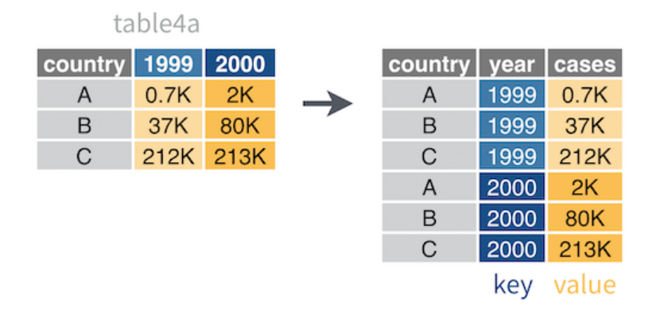

```{r}
library(tidyverse)
```

# Creating tibble

```{r}
tribble(~number, ~letter,   ~greek,
              1,     "a",  "alpha",
              2,     "b",   "beta",
```


```{r}
y <- tibble(number = c(1, 2, 3), 
       letter = c("a", "b", "c"),
       greek = c("alpha", "beta", "gamma"))
```
# Convert a dta frame to a tibble
```{r}
x <- iris # iris is still a data frame
```

```{r}
x <- as_tibble(x) # this will make x a tibble 
```

```{r}
class(x) # verifying if x is already a tibble
```
# Converting a tibble to a data frame 

```{r}
z <-table1
```

```{r}
z
```

```{r}
class(z)
```
```{r}
z <- as.data.frame(table1)
```

# inspect every cell of a tibble
```{r}
view(storms)
```

# Spread a pair of columns into a field of cells

```{r}
table2 #untidy data

```

```{r}
table2_tidy <- table2 %>% # and then
  spread(key = type, value = count)
table2_tidy
```
### Gather a field of cells into a pair of columns

## Separate a column into new columns

```{r}
table3_sep <- table3 %>% 
  separate(col = rate,
           into = c("cases", "population"), 
           sep = "/", 
           convert = TRUE)
table3_sep

```

